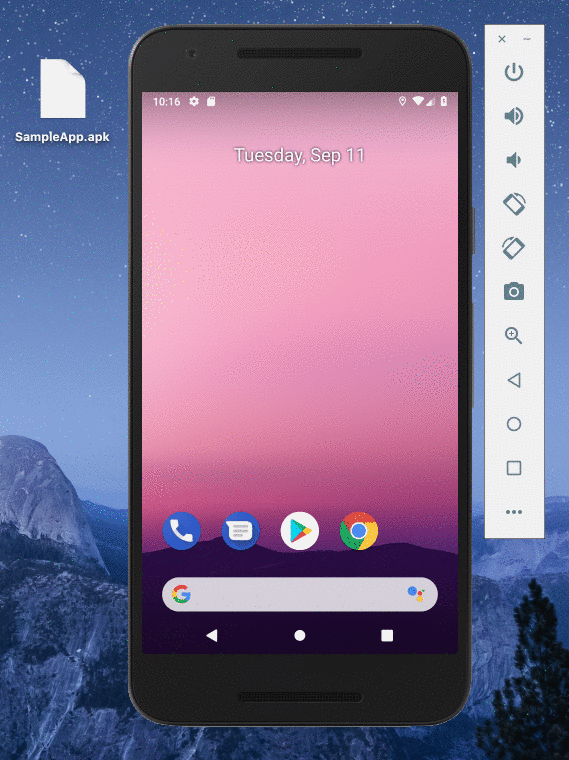

# DeviceFarm Sample Tests

This repository contains examples of tests performed to OutSystems mobile applications using [Appium](http://appium.io/) and [AWS Device Farm](https://aws.amazon.com/pt/device-farm/). **Please note that all commands in this README file were created and tested in MacOS systems. For other operating systems some steps may be different.**

**Appium** is a testing automation framework for Android and iOS mobile applications that allow us to test either native or hybrid applications.

**AWS Device Farm** is a cloud testing service that allows us to run our tests on real Android and iOS devices. After each run we have access to all test/device logs, screenshots, performance graphs and much more.

## Install Dependencies

1. Install [Node.js](https://nodejs.org/) via [package manager](https://nodejs.org/en/download/package-manager/)

    ```
    brew install node
    ```

2. Install [Python](https://www.python.org/) 2.7

    ```
    brew install python@2
    ```

3. Install [Appium](http://appium.io/)

    ```
    npm install -g appium@1.7.6
    npm install -g appium-doctor
    ```

    After installing Appium, run **appium-doctor** in your terminal and check if you have everything ready to go. If not, please take your time and configure you machine in order for you to be able to run mobile tests.

    ```
    $ appium-doctor --android
    info AppiumDoctor Appium Doctor v.1.4.3
    info AppiumDoctor ### Diagnostic starting ###
    info AppiumDoctor  ✔ The Node.js binary was found at: /Users/bruno/.nodenv/versions/8.11.2/bin/node
    info AppiumDoctor  ✔ Node version is 8.11.2
    info AppiumDoctor  ✔ ANDROID_HOME is set to: /Users/bruno/.android-sdk
    info AppiumDoctor  ✔ JAVA_HOME is set to: /Library/Java/Home
    info AppiumDoctor  ✔ adb exists at: /Users/bruno/.android-sdk/platform-tools/adb
    info AppiumDoctor  ✔ android exists at: /Users/bruno/.android-sdk/tools/android
    info AppiumDoctor  ✔ emulator exists at: /Users/bruno/.android-sdk/tools/emulator
    info AppiumDoctor  ✔ Bin directory of $JAVA_HOME is set
    info AppiumDoctor ### Diagnostic completed, no fix needed. ###
    info AppiumDoctor
    info AppiumDoctor Everything looks good, bye!
    info AppiumDoctor
    ```

    ```
    $ appium-doctor --ios
    info AppiumDoctor Appium Doctor v.1.4.3
    info AppiumDoctor ### Diagnostic starting ###
    info AppiumDoctor  ✔ The Node.js binary was found at: /Users/bruno/.nodenv/versions/8.11.2/bin/node
    info AppiumDoctor  ✔ Node version is 8.11.2
    info AppiumDoctor  ✔ Xcode is installed at: /Applications/Xcode.app/Contents/Developer
    info AppiumDoctor  ✔ Xcode Command Line Tools are installed.
    info AppiumDoctor  ✔ DevToolsSecurity is enabled.
    info AppiumDoctor  ✔ The Authorization DB is set up properly.
    info AppiumDoctor  ✔ Carthage was found at: /usr/local/bin/carthage
    info AppiumDoctor  ✔ HOME is set to: /Users/bruno
    info AppiumDoctor ### Diagnostic completed, no fix needed. ###
    info AppiumDoctor
    info AppiumDoctor Everything looks good, bye!
    info AppiumDoctor
    ```

## Install Python Packages

1. Install [Virtualenv](https://pypi.org/project/virtualenv/)

    **Virtualenv** is a tool to create isolated Python environments.

    ```
    pip install virtualenv
    ```

2. Install [Wheelhouse](https://pypi.org/project/Wheelhouse/)

    **wheelhouse** is a local cache of python packages.

    ```
    pip install Wheelhouse
    ```

3. Install [Appium Client](https://pypi.org/project/Appium-Python-Client/)

    **Appium Python Client** is a package to add Selenium [webdriver](https://w3c.github.io/webdriver/) to Python language bindings.

    ```
    pip install Appium-Python-Client
    ```

4. Install [PyTest](https://pypi.org/project/pytest/)

    **PyTest** is a framework for Python that make it easier to write tests.

    ```
    pip install pytest
    ```

## Setup Test Project

1. Create the project directory

    ```
    $ virtualenv mytests
    $ cd mytests
    $ source bin/activate
    ```

2. Implement and store all your Python tests under **tests/** folder. To learn more about Selenium, please click [here](https://selenium-python.readthedocs.io/) and check the documentation.

    ```python
    import os
    import unittest
    from appium import webdriver
    from selenium.webdriver.common.by import By
    from selenium.webdriver.support.ui import WebDriverWait
    from selenium.webdriver.support import expected_conditions as EC

    class TestClass(unittest.TestCase):

        def setUp(self):
            self.driver = webdriver.Remote('http://127.0.0.1:4723/wd/hub', {})
    
        def test_case(self):
            ...

        def tearDown(self):
            self.driver.quit()
        
        if __name__ == '__main__':
            unittest.main()
    ```

## Running your Tests Locally

1. Open the terminal and start the Appium server in your machine

    ```
    $ appium
    ```

2. Connect your device or start the simulator.

    Start Android Emulator:
    ```
    $ANDROID_HOME/emulator/emulator -list-avds
    ```
    ```
    $ANDROID_HOME/emulator/emulator -avd Nexus_5X_API_28
    ```

    Start iOS Simulator:
    ```
    xcrun simctl list
    ```
    ```
    open /Applications/Xcode.app/Contents/Developer/Applications/Simulator.app/
    ```

3. Install the OutSystems app in your Android/iOS device. 

    

4. Uncoment the desired capabilities for your target platform.

    For Android:
    ```
    desired_caps['platformName'] = 'Android'
    desired_caps['deviceName'] = 'aPhone'
    desired_caps['appPackage'] = '<app_id>'
    desired_caps['appActivity'] = ".MainActivity"
    ```

    For iOS:
    ```
    desired_caps['platformName'] = 'iOS'
    desired_caps['platformVersion'] = '<device_version>'
    desired_caps['deviceName'] = '<device_name>'
    desired_caps['bundleId'] = '<app_id>'
    desired_caps['automationName'] = 'XCUITest'
    ```

4. Run your tests.

    ```
    $ py.test tests/login_test.py
    ```

## Running your Tests in AWS Device Farm

You have everyhting ready, but to run your tests in AWS Device Farm you just need to do a few more thing. Check [this](https://docs.aws.amazon.com/devicefarm/latest/developerguide/test-types-android-appium-python.html).